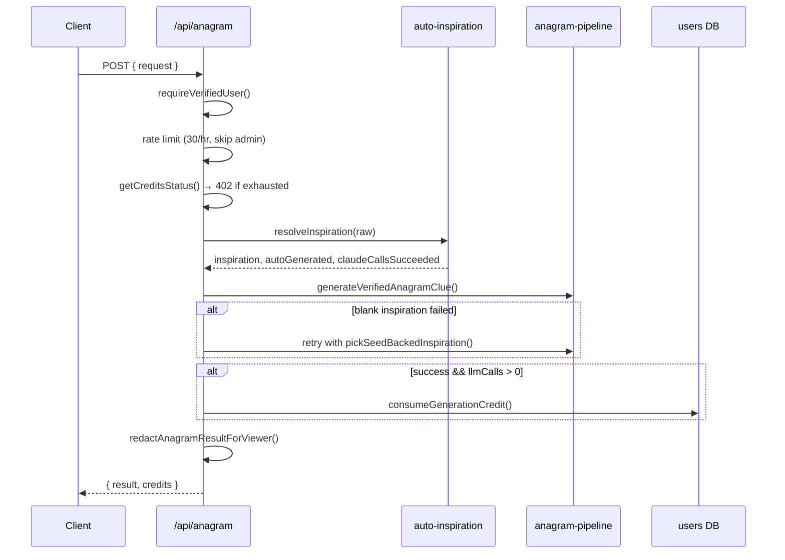
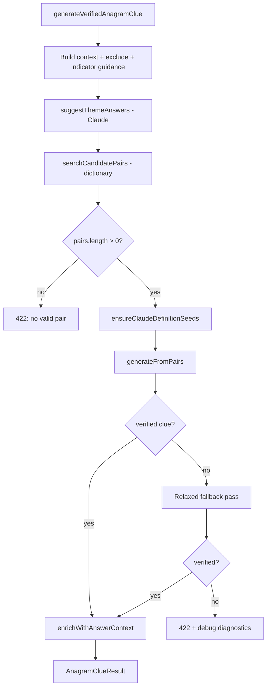
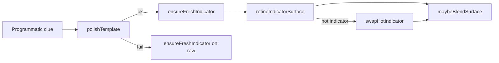
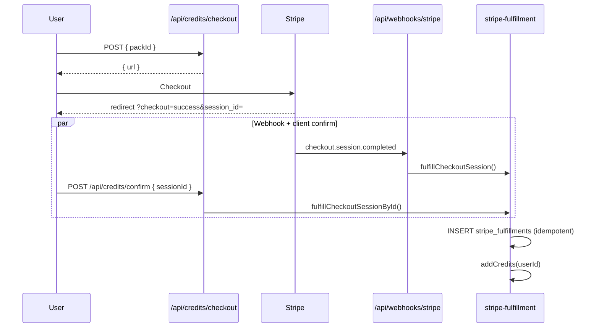

# CrypticAI — System Architecture

Technical reference for developers who need end-to-end understanding of the codebase, with emphasis on the **anagram clue generation engine**.

**Stack:** Next.js 15 App Router · React 19 · Node 22+ · SQLite (`node:sqlite`) · Anthropic Messages API · Stripe · Resend · Railway

**Production:** https://www.crypticai.uk · SQLite volume at `/data/clues.db`

---

## Table of contents

1. [System overview](#1-system-overview)
2. [Repository map](#2-repository-map)
3. [Request lifecycle (browser → clue)](#3-request-lifecycle-browser--clue)
4. [The generation engine (core)](#4-the-generation-engine-core)
5. [Verification subsystem](#5-verification-subsystem)
6. [Dictionary & pair search](#6-dictionary--pair-search)
7. [Programmatic clue construction](#7-programmatic-clue-construction)
8. [Claude integration layers](#8-claude-integration-layers)
9. [Indicator archive & freshness](#9-indicator-archive--freshness)
10. [Exclude / dedup / retry semantics](#10-exclude--dedup--retry-semantics)
11. [Auth, credits, and billing](#11-auth-credits-and-billing)
12. [Archive subsystem](#12-archive-subsystem)
13. [API reference](#13-api-reference)
14. [Database schema](#14-database-schema)
15. [Security, rate limits, monitoring](#15-security-rate-limits-monitoring)
16. [Deployment](#16-deployment)
17. [Environment variables](#17-environment-variables)

---

## 1. System overview

CrypticAI is an **anagram-only cryptic clue builder**. A verified user submits a theme (“inspiration”), the server finds valid answer+fodder letter pairs from a British English dictionary, builds a clue programmatically, optionally polishes it with Claude, verifies every candidate mechanically, and returns a fair anagram clue.

**Design principle:** Letter math is never trusted from the LLM. Claude ranks, polishes prose, and explains — but `answer` and `anagramFodder` are **locked** to the verified pair after every model call.

```mermaid
flowchart TB
  subgraph client [Client]
    Page[app/page.tsx]
    Form[AnagramForm]
    Result[AnagramResult]
  end

  subgraph api [API layer]
    AnagramRoute[POST /api/anagram]
    AuthRoutes[/api/auth/*]
    ArchiveRoute[/api/archive]
    StripeRoutes[/api/credits/*]
  end

  subgraph engine [Generation engine]
    AutoInsp[auto-inspiration.ts]
    Pipeline[anagram-pipeline.ts]
    Dict[anagram-dictionary.ts]
    Surface[anagram-surface.ts]
    Verify[anagram-engine.ts]
    LLM[llm.ts + anagram-prompts.ts]
  end

  subgraph data [Persistence]
    SQLite[(clues.db)]
  end

  Page --> Form
  Page --> Result
  Form --> AnagramRoute
  Result --> ArchiveRoute
  AnagramRoute --> AutoInsp
  AnagramRoute --> Pipeline
  Pipeline --> Dict
  Pipeline --> Surface
  Pipeline --> Verify
  Pipeline --> LLM
  AuthRoutes --> SQLite
  ArchiveRoute --> SQLite
  StripeRoutes --> SQLite
  Dict --> Verify
```

---

## 2. Repository map

```
crypticAI/
├── app/
│   ├── page.tsx                 # Main SPA: auth, generate, archive tabs
│   ├── layout.tsx               # Fonts, metadata, footer
│   ├── api/
│   │   ├── anagram/route.ts     # ★ Generation entry point
│   │   ├── archive/route.ts     # Search + save clues
│   │   ├── auth/*               # Signup, login, verify, me, delete
│   │   ├── credits/*            # Stripe checkout + confirm
│   │   ├── webhooks/stripe/     # Payment fulfillment
│   │   ├── health/route.ts      # Railway healthcheck
│   ├── about|terms|privacy/     # Static legal/marketing pages
│   └── error.tsx                # Client error → Sentry relay
│
├── components/
│   ├── AnagramForm.tsx          # Inspiration + difficulty
│   ├── AnagramResult.tsx        # Clue display, retry, improve, archive
│   ├── ClueImprovementEditor.tsx# Human rewrite + notes
│   ├── ArchiveCluePanel.tsx     # Star rating + POST archive
│   ├── ClueArchiveSearch.tsx    # Archive tab search UI
│   ├── AuthPanel.tsx            # Login/signup
│   ├── AccountMenu.tsx          # Credits, logout, delete
│   └── …                        # Share, copy, answer checker, etc.
│
├── lib/
│   ├── anagram-pipeline.ts      # ★ Orchestrator
│   ├── anagram-engine.ts        # prepare + verify wrapper
│   ├── anagram-dictionary.ts    # Pair search & ranking
│   ├── anagram-surface.ts       # Programmatic clue templates
│   ├── anagram-fallback-clue.ts # Re-export of anagram-surface
│   ├── clue-verify.ts           # Core verification rules
│   ├── anagram-prompts.ts       # All Claude prompt templates
│   ├── auto-inspiration.ts      # Blank inspiration → theme
│   ├── generation-exclude.ts    # Session + archive dedup
│   ├── indicator-archive-weights.ts
│   ├── llm.ts                   # Anthropic HTTP client
│   ├── models.ts                # Model name env resolution
│   ├── types.ts                 # Shared TypeScript types
│   ├── db/                      # SQLite modules
│   ├── auth/                    # Session, password, require-user
│   └── …                        # See section 2.1
│
├── scripts/                     # Stripe setup, backup, smoke tests
├── docs/ARCHITECTURE.md         # This file
├── railway.toml                 # Deploy config
└── nixpacks.toml                # Node 22 pin
```

### 2.1 `lib/` module groups

| Group | Files | Role |
|-------|-------|------|
| **Pipeline core** | `anagram-pipeline.ts`, `ensure-definition-seeds.ts`, `claude-definition-seeds.ts` | Orchestration |
| **Verification** | `anagram-engine.ts`, `clue-verify.ts`, `anagram-mix.ts`, `fodder-quality.ts`, `definition-quality.ts`, `theme-link-quality.ts`, `clue-capitalization-align.ts`, `clue-surface-tightness.ts`, `clue-surface-blend.ts` | Mechanical fairness |
| **Dictionary** | `word-list.ts`, `anagram-trie.ts`, `phrase-anagram.ts`, `anagram-dictionary.ts`, `inspiration-parse.ts`, `theme-scoring.ts` | Answer/fodder discovery |
| **Surface craft** | `anagram-surface.ts`, `anagram-indicators.ts`, `fodder-surface.ts`, `fodder-contractions.ts`, `fodder-names.ts`, `clue-surface-rules.ts`, `clue-surface-link.ts` | Template clues |
| **LLM** | `llm.ts`, `models.ts`, `anagram-prompts.ts`, `claude-trace.ts`, `answer-context.ts`, `clue-surface-explain.ts`, `auto-inspiration.ts` | Anthropic calls |
| **Dedup** | `generation-exclude.ts`, `clue-history.ts`, `indicator-archive-weights.ts` | Avoid repeats |
| **Auth/DB** | `auth/*`, `db/*`, `admin.ts`, `rate-limit.ts` | Identity & persistence |
| **Payments** | `stripe.ts`, `stripe-fulfillment.ts`, `credit-packs.ts` | Credits |

---

## 3. Request lifecycle (browser → clue)

### 3.1 Page state (`app/page.tsx`)

The home page is a client component with two tabs: **Generator** and **Archives**.

Key state:

| State | Type | Purpose |
|-------|------|---------|
| `session` | `AuthMeResponse \| null` | User + credits from `/api/auth/me` |
| `request` | `AnagramRequest` | `{ inspiration, difficulty, exclude? }` |
| `result` | `AnagramClueResult \| null` | Last successful generation |
| `usedClues` | `UsedAnagramClue[]` | Session answers for retry dedup |

**Generate flow:**

```
User submits AnagramForm
  → generate() calls fetchAnagram(request)
  → POST /api/anagram { request: { inspiration, difficulty } }
  → 180s client timeout
  → setResult + setUsedClues([toUsedClue(clue)])
  → AnagramResult renders
```

**Retry flow:**

```
User clicks Generate again on AnagramResult
  → retry() sends same inspiration + difficulty
  → exclude: usedClues (all session answers for this theme)
  → Pipeline widens search pool, merges archive excludes
```

`toUsedClue()` (`lib/clue-history.ts`) extracts `{ answer, anagramFodder, clue, anagramIndicator }` from each result.

### 3.2 API route (`app/api/anagram/route.ts`)



**Credit rule:** A credit is consumed only when `outcome.llmCalls + claudeCallsSucceeded > 0`. Pure programmatic success (no Claude calls at all) is free.

**Admin redaction:** Non-admins never receive `claudeTrace` or `prompts` (`lib/redact-anagram-result.ts`).

**Timeouts:** Route `maxDuration = 180s`. Pipeline internal budget `PIPELINE_BUDGET_MS = 150_000`. Per-Claude call timeout `LLM_TIMEOUT_MS = 35_000`.

---

## 4. The generation engine (core)

**File:** `lib/anagram-pipeline.ts`  
**Entry:** `generateVerifiedAnagramClue(apiKey, req, options?)`

### 4.1 PipelineContext

Shared mutable context for one generation run:

```typescript
interface PipelineContext {
  apiKey: string;
  inspiration: string;
  autoThemed: boolean;
  suggestedAnswers: string[];      // from Claude answer list
  difficulty: "easy" | "hard";
  bounds: { min, max? };           // answer length bounds
  exclude: UsedAnagramClue[];      // session + archive
  avoidIndicators: string[];
  indicatorGuidance: IndicatorGuidance;
  setterPrompt: string;            // stored in result.prompts.setter (admin only)
  // Prompt buckets for admin trace:
  repairPrompts, surfacePrompts, answerPrompts, pairSelectPrompts,
  templatePolishPrompts, indicatorRefinePrompts, hotIndicatorSwapPrompts,
  surfaceBlendPrompts;
  claudeTrace: ClaudeCallTrace[];
  claudeDefinitionSeeds: string[];
  llmCalls: number;
  deadlineAt: number;              // Date.now() + 150s
  usedClaudeRanking: boolean;
  minThemeScore?: number;           // default 350, relaxed 220
  skipLlmPolish?: boolean;          // relaxed fallback only
}
```

### 4.2 Stage diagram



### 4.3 Setup stage

1. **Difficulty bounds** (`lib/anagram-difficulty.ts`):
   - Easy: 3–10 letters
   - Hard: ≥8 letters, no upper cap

2. **Exclude list** (`lib/generation-exclude.ts`):
   - Merges `req.exclude` (session retries) with archived clues for same inspiration
   - Used to filter answers and indicators

3. **Indicator guidance** (`lib/indicator-archive-weights.ts`):
   - `buildIndicatorGuidance({ themeAvoid, seed })` → `{ avoid, prefer, hot, archiveCounts }`

4. **Setter prompt** built but **never sent to Claude** in current pipeline — only included in admin `prompts.setter` on success.

### 4.4 Theme answer suggestions

` suggestThemeAnswers(ctx)` — one Claude call:

- System: `ANAGRAM_ANSWER_LIST_SYSTEM`
- User: `buildAnagramAnswerListPrompt(inspiration, exclude answers, difficulty)`
- Returns up to 16–20 themed answer strings
- Feeds `collectAnswerCandidates()` prioritization in dictionary search

### 4.5 Pair search tuning

| Parameter | First pass (easy) | First pass (hard) | Retry (+exclude) |
|-----------|-------------------|-------------------|------------------|
| `dictionaryScanLimit` | 80 | 120 | +40–60 |
| `maxAnswersToProcess` | 32 | 48 | +0–12 |
| `pairPoolLimit` | 48 | 48–96 | scales with exclude count |

`selectPairWithClaude()` optionally re-ranks first 32 pairs; chosen pair moved to front. Sets strategy toward `claude-ranked-pair`.

### 4.6 generateFromPairs (inner loop)

For each `AnagramPair` (up to `MAX_PAIRS_TO_TRY = 32`):

```
1. Skip if isAnswerExcluded(pair.answer, exclude)
2. buildProgrammaticClue(pair, inspiration, surfaceBuildOptions)
3. successResult(ctx, draft, pair, "programmatic-surface")
   → verifyAnagramClue; return if ok
4. If skipLlmPolish: continue to next pair
5. If time remains:
   a. polishTemplate() — up to MAX_POLISH_ATTEMPTS (2)
   b. On polish success: ensureFreshIndicator()
   c. On polish failure: ensureFreshIndicator() on plain programmatic clue
6. If no polish time: return plain programmatic clue
```

**`lockPairDraft(draft, pair)`** — after every Claude JSON parse, forces:

```typescript
{ ...draft, answer: pair.answer, anagramFodder: pair.fodder }
```

Then re-runs `prepareAnagramClue()`.

### 4.7 Claude polish chain



| Function | Max attempts | Strategy label |
|----------|--------------|----------------|
| `polishTemplate` | 2 | `template-polish` |
| `refineIndicatorSurface` | 2 | `indicator-refine` |
| `swapHotIndicator` | 1 | `indicator-refine` |
| `maybeBlendSurface` | 1 | `surface-blend` |
| `selectPairWithClaude` | 1 | enables `claude-ranked-pair` |

Each attempt: Claude returns JSON → `lockPairDraft` → `verifyAnagramClue` → accept or repair prompt.

### 4.8 Post-success enrichment

Only if ≥20s pipeline time remains (`enrichWithAnswerContext`):

1. **`buildAnswerContext`** — dictionary lookup + Claude explains definition and topic link
2. **`buildClueSurfaceExplanation`** — Claude explains definition/wordplay/walkthrough
3. **`applyExplanationCapitalizationToClue`** — align clue caps with explanation

Uses `explainModel()` (default `claude-opus-4-8`, override `ANTHROPIC_EXPLAIN_MODEL`).

### 4.9 Relaxed fallback

If primary pass fails but time remains:

```typescript
relaxedCtx = {
  ...ctx,
  minThemeScore: 220,        // vs default 350
  skipLlmPolish: true,
  avoidIndicators: themeAvoid only,  // not full hot list
}
```

May re-search with deeper dictionary scan if `pairs.length < 8`. Returns first verified **programmatic** clue with strategy `"programmatic-surface"`.

### 4.10 Failure diagnostics

`summarizePairFailures()` probes up to 12 pairs, counts template build vs verification failure frequencies → attached as `debug` on 422 responses (logged server-side).

### 4.11 Result type

```typescript
interface AnagramClueResult {
  inspiration: string;
  autoThemed?: boolean;
  clue: AnagramClueDraft;
  verified: true;
  verification: AnagramVerification;
  answerContext?: AnswerContext;
  surfaceExplanation?: ClueSurfaceExplanation;
  attempts: number;
  strategy: AnagramStrategy;
  difficulty: AnagramDifficulty;
  llmCalls: number;
  claudeTrace?: ClaudeCallTrace[];   // admin only
  prompts?: { ... };                 // admin only
}
```

**Strategy values:** `programmatic-surface` | `template-polish` | `indicator-refine` | `surface-blend` | `claude-ranked-pair`

---

## 5. Verification subsystem

**Files:** `lib/anagram-engine.ts`, `lib/clue-verify.ts`, plus many quality modules.

### 5.1 prepareAnagramClue

Normalizes a draft before verification:

- `formatFodderForClue`, `applyFodderCasingInClue`, `applyPlaceCasingInClue`
- `restoreContractionsInClue`, `normalizeClueCapitalization`
- `fixEnumerationInClue`

### 5.2 verifyAnagramClue checks

Runs `prepareAnagramClue` first, then accumulates named checks:

| Check | Module / function |
|-------|-------------------|
| Required fields | answer, clue, anagramFodder present |
| `enumeration` | Bracket count matches answer length |
| `no standalone answer` | Answer not as whole word in clue |
| `anagram indicator` | `hasAnagramIndicator()` |
| `no inspiration words in answer` | Theme words not in answer |
| `theme link` | `verifyAnswerThematicLink` (min score 350, relaxed 220) |
| `fodder dictionary` | All fodder words in GB dictionary |
| `fodder readability` | Grammatical dictionary fodder |
| `fodder proper names` | No improper proper names in fodder |
| `capitalisation` | Clue capitalization rules |
| `definition theme` | Definition not vague |
| `definition fits answer` | Definition matches answer semantically |
| `no superfluous words` | No orphan words outside def/fodder/indicator |
| `fodder in clue` | Fodder words appear in clue text |
| `letter counts` | Multiset equality answer ↔ fodder |
| `letter mix` | Not trivial word-chunk reorder |
| `linking words` | Max linking words (`MAX_LINKING_WORDS`) |
| `contraction spelling` | Valid contractions |
| `anagram structure` | Full structural verify |

Returns `{ ok, errors[], checks[], prepared }`.

### 5.3 Trivial mix rejection

`lib/anagram-mix.ts` — rejects fodder that only splits the answer into contiguous chunks and reorders them (e.g. CATWOMAN → "woman cat").

---

## 6. Dictionary & pair search

**File:** `lib/anagram-dictionary.ts`

### 6.1 Word source

`lib/word-list.ts` loads `dictionary-en-gb` (3–12 letter British words, in-memory).

### 6.2 Anagram algorithms

| Type | Module | Method |
|------|--------|--------|
| Single word | `anagram-trie.ts` | Prefix trie over dictionary |
| Multi-word phrase | `phrase-anagram.ts` | DFS word decomposition |

### 6.3 AnagramPair

```typescript
interface AnagramPair {
  answer: string;
  fodder: string;
  themeScore: number;
  isPhrase?: boolean;
  isMultiWordAnswer?: boolean;
}
```

### 6.4 Pair discovery per answer

For each candidate answer:

1. `findFodderCandidates()` — single-word anagrams via trie
2. `findPhraseFodderCandidates()` — multi-word anagrams via phrase DFS
3. Up to `MAX_FODDERS_PER_ANSWER = 4` fodders per answer
4. Filters: trivial reorder, exposes answer word, weak theme, bad grammar

### 6.5 Answer discovery (`collectAnswerCandidates`)

1. Claude-suggested answers (validated for theme)
2. Full dictionary scan scored by `scoreAnswerRelevance`, filtered by `meetsThematicBar` (≥350)
3. Entity candidates from `parseInspiration()`
4. Hard mode: dictionary candidates before entity fragments

### 6.6 Theme score

```
pairThemeScore = answerScore + fodderScore + grammarScore + phraseBonus(10 if multi-word fodder)
```

Pairs sorted descending; `listCandidatePairs()` returns top N.

---

## 7. Programmatic clue construction

**File:** `lib/anagram-surface.ts` (re-exported via `anagram-fallback-clue.ts`)

### 7.1 buildProgrammaticClue

Cartesian search over:

- Definition phrases (from registry + Claude seeds)
- 10 surface patterns (e.g. `"Perhaps ${d} if ${f} ${i} ${e}"`)
- Indicator phrases (archive-weighted)
- Fodder word order variants

Each candidate is **verified immediately**. Best-scoring verified candidate wins.

Scoring via `scoreSurface()`: linking words, indicator freshness, definition quality, blend score.

### 7.2 Fallback

`buildFallbackClue()` — simple template if cartesian search finds nothing:

```
"${definition} where ${fodder} ${indicator} ${enumeration}"
```

### 7.3 Indicators

**File:** `lib/anagram-indicators.ts`

- 36 single-word indicators
- 60+ multi-word phrases
- `OVERUSED_ANAGRAM_INDICATORS`: scrambled, muddled, mixed, jumbled, shuffled
- `extractIndicatorFromClue()` — longest multi-word match first
- `usedIndicatorsFromClues()` — builds theme-specific avoid list

---

## 8. Claude integration layers

### 8.1 HTTP client (`lib/llm.ts`)

```typescript
anthropicChatJson({ apiKey, model, system, user, maxTokens, timeoutMs })
```

- POST `https://api.anthropic.com/v1/messages`
- `anthropic-version: 2023-06-01`
- AbortController per call
- `parseModelJson()` — strips markdown fences, extracts first `{...}`

### 8.2 Models (`lib/models.ts`)

| Function | Default | Env override |
|----------|---------|--------------|
| `setterModel()` | `claude-opus-4-8` | `ANTHROPIC_SETTER_MODEL` |
| `explainModel()` | `claude-opus-4-8` | `ANTHROPIC_EXPLAIN_MODEL` |

All pipeline polish/rank calls use `setterModel()`. Enrichment uses `explainModel()`.

### 8.3 Prompt schema (all clue-producing calls)

```json
{
  "answer": "UPPERCASE",
  "clue": "full cryptic clue ending with (N)",
  "anagramFodder": "exact fodder words from clue",
  "definition": "which phrase defines the answer",
  "anagramIndicator": "which word(s) signal the anagram"
}
```

**File:** `lib/anagram-prompts.ts` — all system/user prompt builders.

### 8.4 Claude call trace

`lib/claude-trace.ts` — `createClaudeCallRecorder()` appends `{ order, label, system, user, response }` to `ClaudeCallTrace[]`.

Admin users see full trace in `AnagramResult` via `showClaudeTrace`.

### 8.5 Auto-inspiration (`lib/auto-inspiration.ts`)

When inspiration field is blank:

1. Claude suggests theme (`suggestThemeWithClaude`, 25s timeout)
2. Fallback: `pickFallbackTheme()` from definition seed registry
3. Counts toward `claudeCallsSucceeded` for credit billing

---

## 9. Indicator archive & freshness

**File:** `lib/indicator-archive-weights.ts`

### 9.1 Archive counts

- Reads last 500 archived clues from SQLite
- Extracts indicator from `anagramIndicator` field or parses from clue text
- Cached 5 minutes

### 9.2 Hot threshold

```typescript
HOT_INDICATOR_THRESHOLD = 3  // uses in archive → "hot"
```

### 9.3 Guidance output

```typescript
interface IndicatorGuidance {
  themeAvoid: string[];    // from session + archive excludes
  hot: string[];           // archive count ≥ 3
  avoid: string[];         // themeAvoid ∪ hot
  prefer: string[];        // zero archive uses, shuffled
  archiveCounts: Map<string, number>;
}
```

### 9.4 Usage

1. **Prompts** — deprioritize hot/overused indicators in Claude guidance text
2. **Programmatic** — `pickIndicatorPhrases()` sorts by ascending archive count
3. **Post-polish** — `swapHotIndicator()` replaces hot indicators via Claude

---

## 10. Exclude / dedup / retry semantics

**File:** `lib/generation-exclude.ts`

### 10.1 Exclude sources

```typescript
buildGenerationExcludeList(inspiration, sessionExclude)
  = sessionExclude + archivedCluesForInspiration(inspiration)
```

### 10.2 What's excluded

- **Answers** must be unique per inspiration (`isAnswerExcluded`)
- **Indicators** from excluded clues added to `themeAvoid`
- Pairs filtered before search via `filterExcludedPairs`

### 10.3 Retry behavior

When `exclude.length > 0`:

- Larger pair pool (`RETRY_PAIR_POOL_BASE = 64`)
- Deeper dictionary scan
- User sees "Generate" on same inspiration until exhausted → 422 with message to broaden theme or Restart

---

## 11. Auth, credits, and billing

### 11.1 Session (`lib/auth/session.ts`)

Cookie `crypticai_session` = `{userId}.{exp}.{hmac}` signed with `SESSION_SECRET`.

30-day expiry, httpOnly, secure in production.

### 11.2 Signup → verify → login

1. `POST /api/auth/signup` — creates user, sends verification email, **no session**
2. `GET /api/auth/verify-email?token=` — verifies, sets session, redirects `/?verified=1`
3. `POST /api/auth/login` — blocked until verified

Admin alert email on new signup (`lib/email/signup-alert-email.ts` → `ADMIN_EMAILS`).

### 11.3 Credits (`lib/db/users.ts`)

```typescript
interface CreditsStatus {
  freeRemaining: number;   // 6 - freeSpinsUsed (lifetime-capped per email)
  paidCredits: number;
  canGenerate: boolean;
  adminUnlimited?: boolean;
}
```

**Consumption order:** free spins first, then paid credits.

**Lifetime free spins:** `lib/db/free-spin-claims.ts` tracks per-email usage across account deletions.

### 11.4 Stripe flow



**Packs:** `pack_5` (5 credits, £2), `pack_12` (12 credits, £4) — `lib/credit-packs.ts`

---

## 12. Archive subsystem

### 12.1 Save flow

`ArchiveCluePanel` → `POST /api/archive` (verified user, 20/hr rate limit):

```typescript
{
  inspiration, difficulty, answer, clue,
  anagramFodder, anagramIndicator, rating (1-5),
  originalClue?,      // if human-edited
  improvementNotes?,  // required when originalClue set
}
```

### 12.2 Schema extensions

```sql
original_clue TEXT;       -- AI version if rewritten
improvement_notes TEXT;   -- human notes on changes
```

Auto-migrated on first DB access (`migrateArchivedCluesTable`).

### 12.3 Search

`GET /api/archive?inspiration=&difficulty=&rating=&minRating=&limit=` — **public**, no auth.

Archive feeds back into generation via exclude list and indicator counts.

### 12.4 Human improvement UI

`ClueImprovementEditor` — rewrite clue text + notes before archiving.  
Displayed clue, share, copy, and archive all use the improved version.

---

## 13. API reference

| Route | Auth | Rate limit | Notes |
|-------|------|------------|-------|
| `POST /api/anagram` | Verified | 30/hr/user | `maxDuration: 180` |
| `GET /api/archive` | Public | — | Search |
| `POST /api/archive` | Verified | 20/hr/user | Save |
| `GET /api/archive/inspirations` | Public | — | Autocomplete |
| `POST /api/auth/signup` | — | 5/hr/IP | |
| `POST /api/auth/login` | — | 10/15min/IP | |
| `GET /api/auth/verify-email` | — | — | Auto-login |
| `POST /api/auth/verify-email` | — | 3/hr/IP+email | Resend |
| `GET /api/auth/me` | Cookie | — | |
| `POST /api/auth/logout` | — | — | |
| `POST /api/auth/delete-account` | Session+password | — | |
| `POST /api/credits/checkout` | Verified | — | |
| `POST /api/credits/confirm` | Verified | — | |
| `POST /api/webhooks/stripe` | Stripe sig | — | |
| `GET /api/health` | Public | — | Railway probe |
| `POST /api/client-error` | Public | 20/hr/IP | Sentry relay |

No Next.js middleware — auth is per-route via `requireVerifiedUser()`.

---

## 14. Database schema

Single SQLite file, WAL mode. Path: `DATABASE_PATH` (default `./data/clues.db`, prod `/data/clues.db`).

Each `lib/db/*` module owns its table(s) with a lazy singleton connection to the same file.

| Table | Module | Key columns |
|-------|--------|-------------|
| `users` | `db/users.ts` | email, password_hash, credits, free_spins_used, email_verified_at, verification tokens |
| `free_spin_claims` | `db/free-spin-claims.ts` | email, lifetime free spins used |
| `archived_clues` | `db/clue-archive.ts` | inspiration, clue, answer, fodder, indicator, rating, original_clue, improvement_notes |
| `stripe_fulfillments` | `stripe-fulfillment.ts` | session_id (unique), user_id, credits |
| `rate_limits` | `rate-limit.ts` | key, window_start, count |
| `definition_seed_cache` | `db/definition-seed-cache.ts` | inspiration key → cached seeds |

---

## 15. Security, rate limits, monitoring

### 15.1 Rate limiting (`lib/rate-limit.ts`)

SQLite fixed-window buckets. Returns 429 with `Retry-After` and `X-RateLimit-*` headers.

### 15.2 Security headers (`next.config.ts`)

`X-Frame-Options: DENY`, `X-Content-Type-Options: nosniff`, `Referrer-Policy`, `Permissions-Policy`.

### 15.3 Monitoring

Optional Sentry via `SENTRY_DSN`. `captureServerError()` in route catch blocks. Client `app/error.tsx` POSTs to `/api/client-error`.

### 15.4 Admin

`ADMIN_EMAILS` env — unlimited credits, skip rate limits, full Claude trace, auto-verified on read.

---

## 16. Deployment

| File | Purpose |
|------|---------|
| `railway.toml` | Build, start, healthcheck `/api/health` (120s timeout) |
| `nixpacks.toml` | Node 22 |
| `railway.backup.toml` | Weekly DB backup cron |
| `DEPLOY.md` | Full ops guide |

**Requirements:**

- Persistent volume at `/data` with `DATABASE_PATH=/data/clues.db`
- Node 22+ for `node:sqlite`
- Long request support (anagram up to 180s)
- `RAILWAY_DEPLOYMENT_DRAINING_SECONDS=30` for graceful shutdown

**Verify prod:** `npm run smoke:prod`

---

## 17. Environment variables

### Required for generation

| Variable | Purpose |
|----------|---------|
| `ANTHROPIC_API_KEY` | All Claude calls |
| `SESSION_SECRET` | Session signing |
| `APP_URL` | Redirects, verification links |

### Model overrides

| Variable | Default |
|----------|---------|
| `ANTHROPIC_SETTER_MODEL` | `claude-opus-4-8` |
| `ANTHROPIC_EXPLAIN_MODEL` | `claude-opus-4-8` |

### Operational

| Variable | Purpose |
|----------|---------|
| `DATABASE_PATH` | SQLite location |
| `ADMIN_EMAILS` | Admin allowlist + signup alerts |
| `RESEND_API_KEY` | Verification + receipt + admin emails |
| `EMAIL_FROM` | Sender address |
| `STRIPE_SECRET_KEY` | Payments |
| `STRIPE_PRICE_ID_5` / `_12` | Credit pack prices |
| `STRIPE_WEBHOOK_SECRET` | Webhook verification |
| `SENTRY_DSN` | Error monitoring |
| `NEXT_PUBLIC_SITE_URL` | Share links, SEO |

### Hardcoded limits (not env-configurable)

| Limit | Value |
|-------|-------|
| Pipeline budget | 150s |
| Route max duration | 180s |
| Per-Claude timeout | 35s |
| Theme score bar | 350 (220 relaxed) |
| Hot indicator threshold | 3 archive uses |
| Anagram rate limit | 30/hr (non-admin) |
| Free spins | 6 per email lifetime |

---

## Quick reference: file → responsibility

| If you need to understand… | Start here |
|----------------------------|------------|
| End-to-end generation flow | `app/api/anagram/route.ts` → `lib/anagram-pipeline.ts` |
| Why a clue failed verification | `lib/anagram-engine.ts` → `lib/clue-verify.ts` |
| How answers/fodder are found | `lib/anagram-dictionary.ts` |
| How clue text is assembled | `lib/anagram-surface.ts` |
| Claude prompts | `lib/anagram-prompts.ts` |
| Indicator variety | `lib/indicator-archive-weights.ts` |
| Retry dedup | `lib/generation-exclude.ts` |
| Frontend orchestration | `app/page.tsx` |
| Credits & billing | `lib/db/users.ts`, `lib/stripe-fulfillment.ts` |
| Auth | `lib/auth/session.ts`, `lib/auth/require-user.ts` |

---

*Generated for CrypticAI maintainers. Update this document when pipeline stages or API contracts change.*
